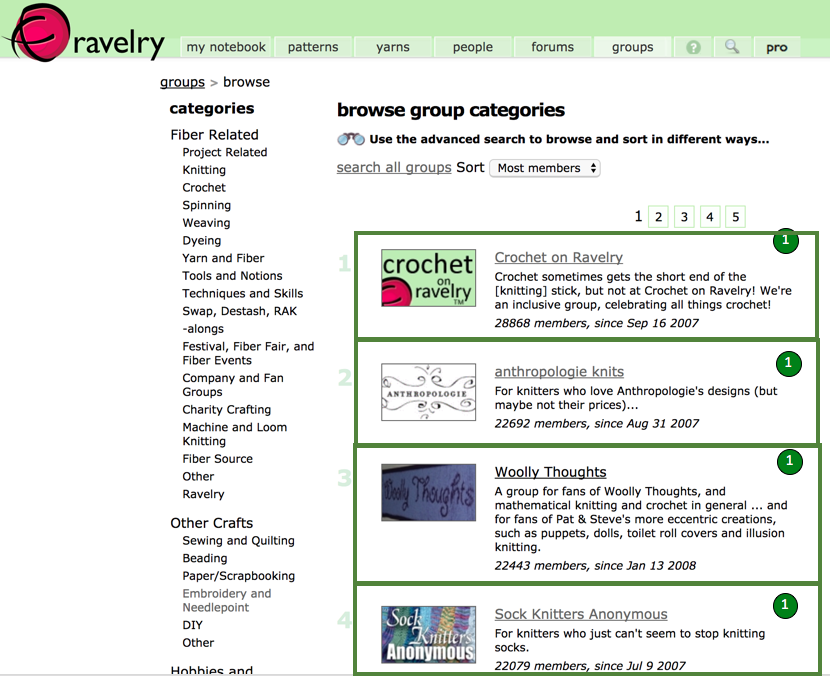
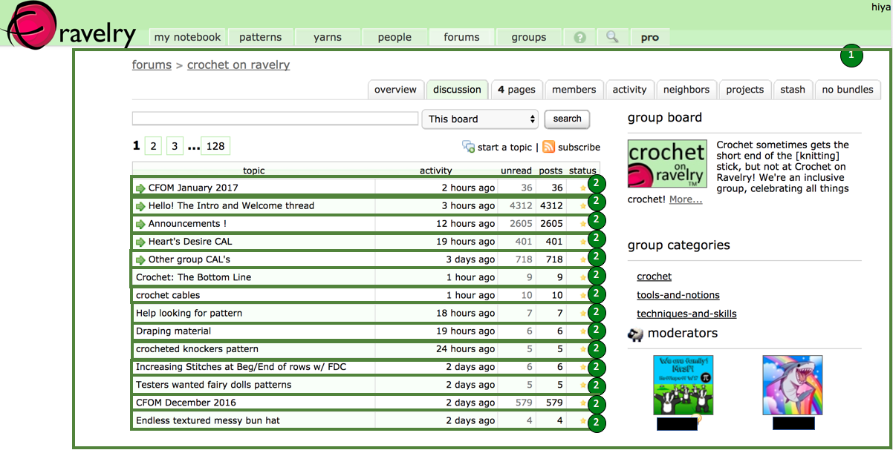
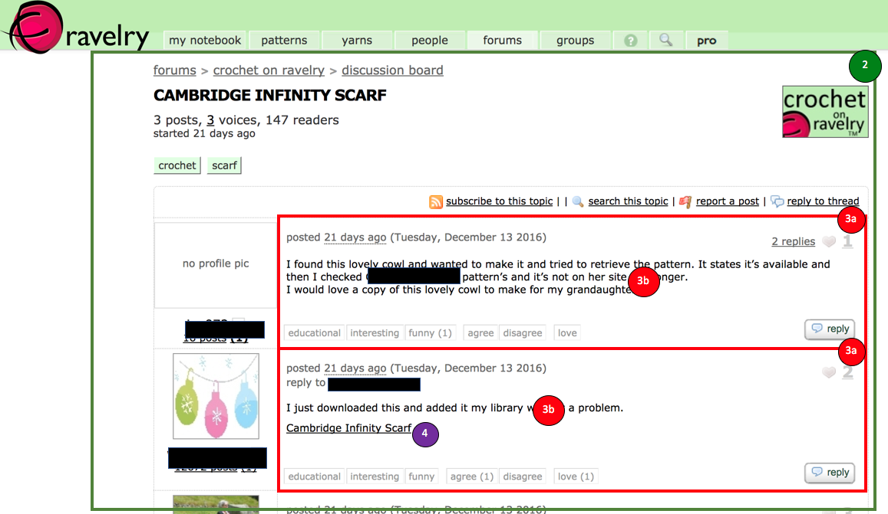
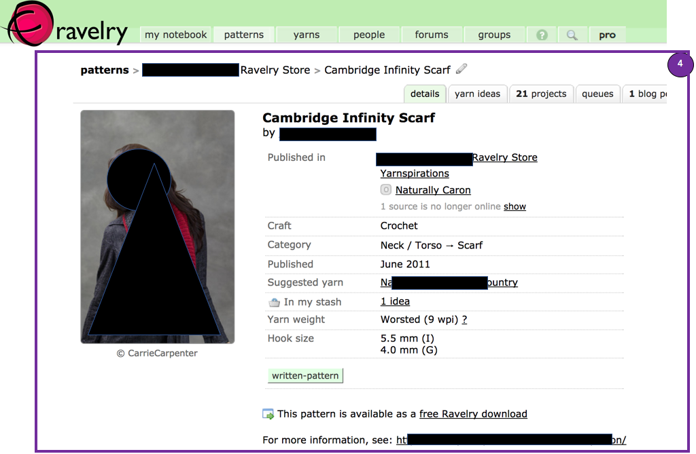

## Ravelry Data Importer

Run RavelryConverterApplication with four command-line arguments:
 * A discourse name (e.g. Ravelry)
 * IP:Port address of a Mongo server containing a scrape of Ravelry API data
 * Database name within Mongo (this will be the Dataset name)
 * Group name to import

Example arguments: Ravelry 127.0.0.1:27027 ravelry-db beginners-knit-along-2

The `custom.properties` file should have the DiscourseDB jdbc database information to write to (jdbc.host, jdbc.database, jdbc.username, and jdbc.password), in variable=value format.  See custom.properties.template for example.

### How Ravelry data is mapped to the DiscourseDB schema

In Ravelry every group has a forum (although there are six additional forums
without a group). A group has a canonical name (a sequence of ASCII characters without spaces) distinct from the
name that users see, that the Ravelry API calls its "permalink". DiscourseDB uses this internally to identify groups.  For example the group "Beginner's Knit-along" has the permalink "beginners-knit-along-2". Each forum is a list of topics (aka threads) containing multiple
postings.  Groups contain other things besides forums, but those are not currently represented in DiscourseDB.

Ravelry groups and threads are treated as nested `DiscourseParts`; Ravelry postings are `Contributions` (each with with associated `Content` node), and Ravelry patterns are also `Content` nodes connected to their mention by a `Contribution_has_context` relation.

Groups are annotated with a textual description and the Ravelry API's numeric ID of the forum they contain.

### Data Sources

| Ravelry Entity | Source ID | Source ID descriptor | Mark in screenshot |
| --- | --- | --- |
| Group/Forum    | `groups#<permalink>`       | ravelry#groups  |   (1) |    
| Topic     | `topics#<numeric topic id>`    |   ravelry#topics| (2) |
| Patterns  |  `pattern#<pattern permalink>` |     ravelry#pattern | (4)  |      
| Postings  | `postings#<post numeric id>`  |    ravelry#postings | (3) |
| Users     |  `people#<username>`           |   ravelry#people | (not shown) |

### Discourse Parts:
| Source ID | Source ID descriptor | DataSourceType | DiscoursePartType |
| --- | --- | --- | --- |
| groups#<permalink>    |   ravelry#groups     |    RAVELRY |  FORUM  |
| topics#<topic_id (numeric)    |   ravelry#topics   |   RAVELRY   |   THREAD |

### Contributions:
| Source ID | Source ID descriptor | DataSourceType | ContributionType |
| --- | --- | --- | --- |
| raverly#postings   |  postings#<post numeric id>  | RAVELRY      |     POST |

### Content
| Source ID | Source ID descriptor | DataSourceType | ContentType |
| --- | --- | --- | --- |
| `pattern#<pattern permalink>` |     ravelry#pattern | RAVELRY | MENTION_OF_PATTERN |
| `pattern#<pattern permalink>` |     ravelry#pattern | RAVELRY | MENTION_OF_PROJECT |
| `postings#<post numeric id>`  |    ravelry#postings | RAVELRY | POST |

### Relations
| From Table | From Type | To Table | To Type | Relation Table | Relation Type | Explanation |
| --- | --- | --- | --- | --- | --- | --- |
| DiscoursePart | FORUM | DiscoursePart | THREAD | DiscoursePartRelation | SUBPART | Topics are part of forums |
| DiscoursePart | THREAD | CONTRIBUTION | POST | ContributionPartOfDiscoursePart | (N/A) | Postings are in Topics |
| Contribution | POST | CONTENT | (N/A) | ContribuionContext | MENTION_OF_PATTERN | When someone gives the URL to a pattern in a post |
| Contribution | POST | CONTENT | (N/A) | ContribuionContext | MENTION_OF_PROJECT | When someone gives the URL to a project in a post |

### Annotations

There is an annotation of type "group_metadata" with two attributes: "description" and "forum_id", which
is attached to FORUM-type DiscourseParts, and contains the group's textual description, and a numeric ID of its
associated forum.

### Screenshots:

