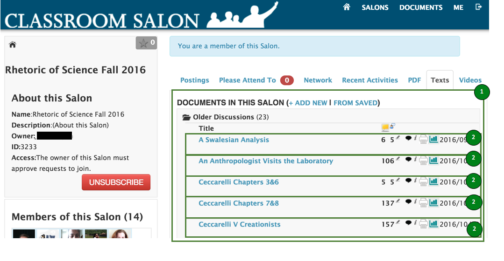
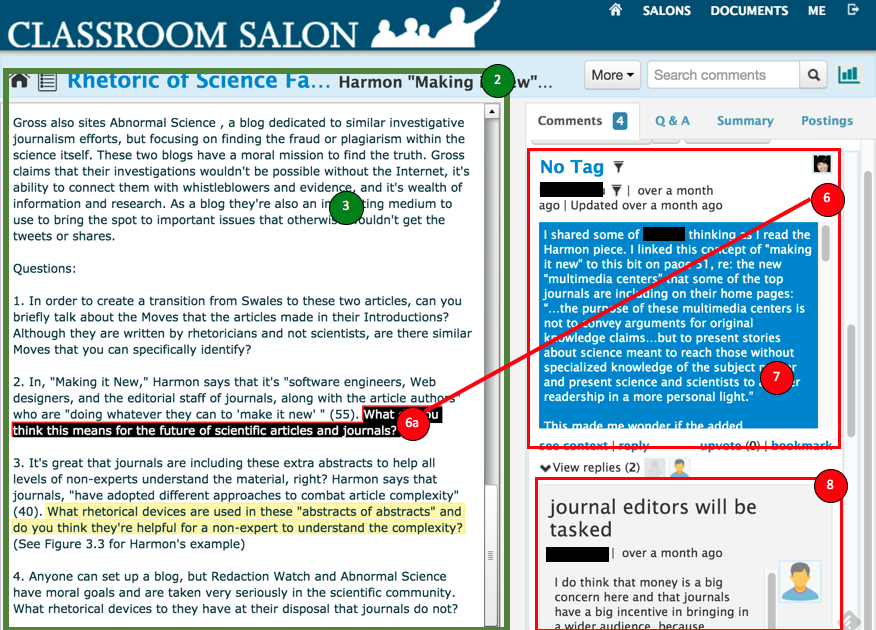
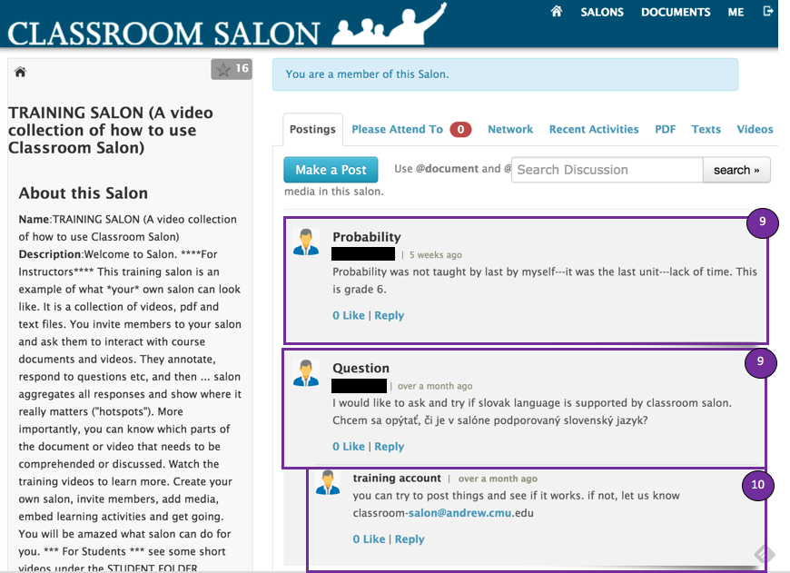

## Classroom Salon data importer

Java import application:
   * SalonConverterApplication

Command-line arguments:
   * &lt;Dataset> &lt;SalonID number>

The `custom.properties` file should have the DiscourseDB jdbc information to write to (jdbc.host, jdbc.database, jdbc.username, and jdbc.password).  See `custom.properties.template` for the file's format.

## How ClassroomSalon data is mapped to the DiscourseDB schema

The DiscourseDB `DiscoursePart`s are highly tested, using `FOLDER`-type `DiscoursePart`s to hold students' annotations as a whole, then annotations on each particular instructor-assigned source document.  The source documents are kept in their own `FOLDER`.

### Data Sources

| Salon Entity | Source ID | Source ID descriptor | Mark in screenshot |
| --- | --- | --- |
| Salon | salons#&lt;salon  id> | salon#salonIDs |   |
| Document Folder | salons#&lt;salon  id>#docs | salon#salonIDs | (1) |
| Document | documents#&lt;document id> | salon#documents | (2) |
| Annotation | annotations#&lt;annotation id> | salon#annotations | (6, 8) |

### Discourse Parts:
| Source ID | Source ID descriptor | DataSourceType | DiscoursePartType |
| --- | --- | --- | --- |
| salons#&lt;salon id>#docs | salon#salonIDs | SALON | FORUM |
| documents#&lt;document id> | salon#documents | SALON | DOCUMENT |
| salons#&lt;salon id>#annos | salon#salonIDs | SALON | FOLDER |
| documentAnnotations#&lt;document id> | salon#documentAnnotations |  SALON | FOLDER |
| salons#&lt;salon id>#questions | salon#salonIDs | SALON | FOLDER |
| questionFolders#&lt;question id> | salon#questions | SALON | FOLDER |

### Contributions:
| Source ID | Source ID descriptor | DataSourceType | ContributionType |
| --- | --- | --- | --- |
| documents#&lt;document id> | salon#documents | SALON | CONTEXT_DOCUMENT |
| annotations#&lt;annotation id> | salon#annotations | SALON | POST |
| questions#&lt;question id> | salon#questions | SALON | QUESTION |
| responses#&lt;response id> | salon#responses | SALON | RESPONSE |

### Users
| Source ID | Source ID descriptor |
| --- | --- |
| user#&lt;user id> | salon#user |

### Content
| Source ID | Source ID descriptor | DataSourceType | ContentType |
| --- | --- | --- | --- |
| `postings#<post id>`  |    ravelry#postings | RAVELRY | POST |

### Relations
| From Table | From Type | To Table | To Type | Relation Table | Relation Type | Explanation |
| --- | --- | --- | --- | --- | --- | --- |
| DiscoursePart | FOLDER | DiscoursePart | FOLDER | DiscoursePartRelation | SUBPART | Document Annotations go under Annotations folder |
| Contribution | POST | Contribution | POST | DiscourseRelation | REPLY |
| Contribution | QUESTION | Contribution | RESPONSE | DiscourseRelation | REPLY |

### Annotations

ClassroomSalon has a concept of annotations; commentary that refers by exact character position to the content of a document.  These are represented as Contributions and Content in DiscourseDB; there are currently no DiscourseDB Annotation entities used in the representation of ClassroomSalon.

### Omitted

Currently not implemented:
 * (9) and (10) are postings at the Salon level rather than tied to a document; there happen to be none in the current dataset, so they are not yet implemented.

Not pictured:
 * The current dataset does not have any questions and answers, so they are not pictured.

### Screenshots:

